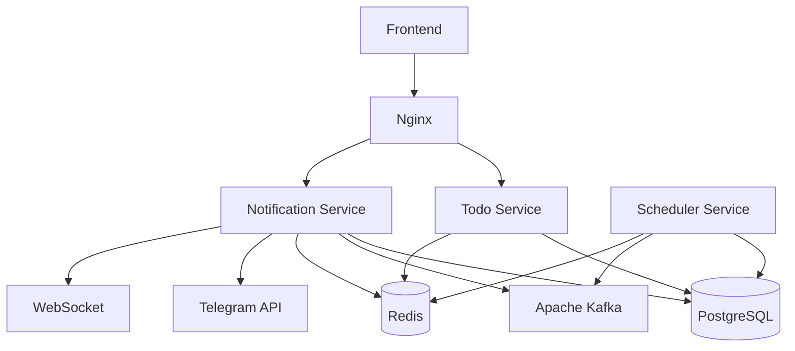

<h1 align="center">Todo Application</h1>

<p align="center">
  <a href="https://github.com/tainj/todo-app/actions">
    
  </a>
  <a href="https://adoptium.net/">
    
  </a>
  <a href="https://spring.io/projects/spring-boot">
    
  </a>
  <a href="LICENSE">
    
  </a>
  <a href="#">
    
  </a>

</p>

A microservice-based task management system with Telegram and WebSocket notifications.

## 📖 Overview

This project helps users manage tasks, set reminders, and receive notifications via Telegram and real‑time WebSocket updates.  
Built with Spring Boot, PostgreSQL, Kafka, Redis, and a modern TypeScript frontend.

## 🏗️ Architecture (simplified)



- **Todo Service** – CRUD operations for tasks/categories, authentication. The **only** service that writes to the database.
- **Scheduler Service** – periodically scans for due reminders, publishes events to Kafka, uses Redis locks to avoid duplicates.
- **Notification Service** – consumes Kafka events, sends Telegram messages, pushes WebSocket updates, stores temporary tokens in Redis.
- **Frontend** – React / Vite app served via Nginx.
- **Nginx** – reverse proxy and WebSocket upgrade.

For a detailed architecture diagram and interaction flows, see [ARCHITECTURE.md](docs/ARCHITECTURE.md).

## 🚀 Quick Start (production‑like)

The easiest way to run the whole system is with Docker Compose:

```bash
git clone https://github.com/your-repo/todo-app.git
cd todo-app
cp .env.example .env
# Edit .env – set TELEGRAM_BOT_TOKEN and TELEGRAM_BOT_USERNAME
docker compose up -d --build
```

The application will be available at **http://localhost:80**.

Check service status:
```bash
docker compose ps
docker compose logs -f
```

## 🔧 Services overview

| Service | Port | Description |
|---------|------|-------------|
| Todo Service | 8080 | Task & category CRUD, auth |
| Scheduler Service | 8082 | Reminder scheduling, Kafka producer |
| Notification Service | 8081 | Kafka consumer, Telegram & WebSocket |
| Frontend | 80 (via Nginx) | User interface |
| PostgreSQL | 5432 | Main database |
| Redis | 6379 | Caching, locks, tokens |
| Kafka | 9092 | Event bus |

## 📂 Project structure

```
.
├── todo-service/          # Spring Boot CRUD API
├── scheduler-service/     # Reminder scheduler
├── notification-service/  # Notification handler
├── front/                 # React/Vite frontend
├── docker-compose.yml
├── .env.example
├── LICENSE
└── README.md
```


## 🤝 Contributing

1. Fork the repo.
2. Create a feature branch.
3. Commit your changes.
4. Push and open a Pull Request.


## 📄 License

MIT License – see [LICENSE](LICENSE) for details.