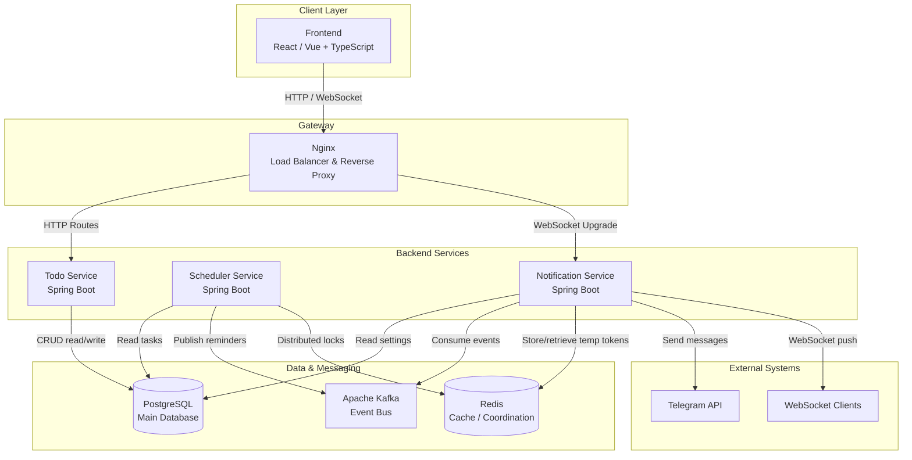
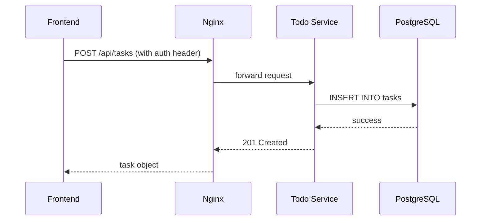
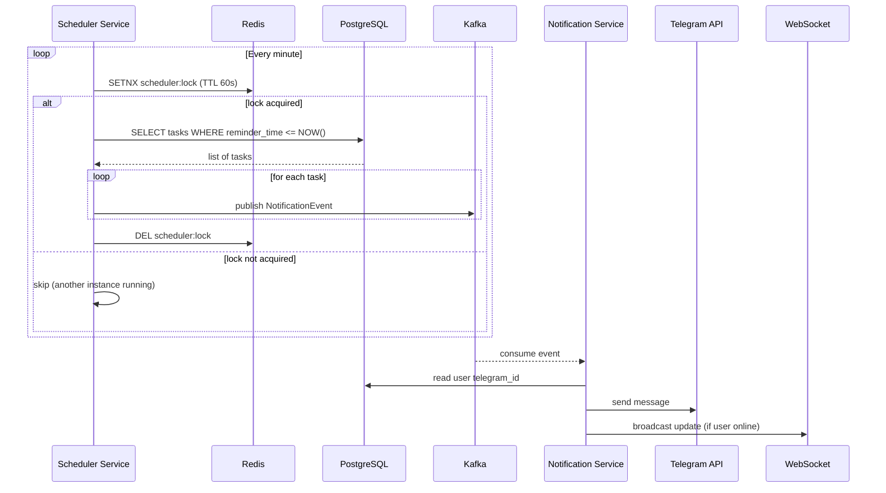

# Architecture

This document describes the internal architecture of the Todo Application, including component responsibilities, data flows, and key technical decisions.

## Overview

The system is built as a set of loosely coupled microservices that communicate synchronously via HTTP/REST and asynchronously via Apache Kafka. Real‑time updates are delivered over WebSocket. The main services are:

- **Todo Service** – handles all write operations (CRUD) for tasks and categories, plus user authentication.
- **Scheduler Service** – periodically scans for due tasks and publishes reminder events.
- **Notification Service** – consumes events and delivers notifications via Telegram and WebSocket.

All services read from the PostgreSQL database, but **only the Todo Service writes to it**. This ensures a single source of truth for data mutations.

---

## Component Diagram

---

## Service Details

### 1. Todo Service

- **Port**: 8080
- **Responsibilities**:
    - Expose REST API for tasks and categories (CRUD)
    - User registration and authentication (JWT)
    - Provide endpoints for linking Telegram accounts (generates temporary tokens, but does not store them)
- **Database**: Read/write access to PostgreSQL (tables: `users`, `tasks`, `categories`)
- **No direct communication** with Kafka or Redis – all secondary concerns are delegated to other services.

### 2. Scheduler Service

- **Port**: 8082
- **Responsibilities**:
    - Periodically (every minute) query PostgreSQL for tasks whose reminder time has passed
    - Publish a `NotificationEvent` to Kafka (topics: `telegram-notifications` and `websocket-notifications`)
    - Use Redis distributed locks to prevent duplicate scheduling when multiple instances run (lock key: `scheduler:lock`)
- **Database**: Read‑only access to tasks and user preferences
- **Scalability**: Can be horizontally scaled; Redis locks ensure only one instance processes the same task at a time.

### 3. Notification Service

- **Port**: 8081
- **Responsibilities**:
    - Consume events from Kafka topics
    - Send Telegram messages using the bot API (requires `TELEGRAM_BOT_TOKEN`)
    - Maintain WebSocket connections with frontend clients and push real‑time updates
    - Store and validate temporary linking tokens in Redis (key: `telegram:token:{userId}`)
- **Database**: Read‑only access to user settings (e.g., notification preferences)
- **Redis usage**:
    - Token storage (TTL ~5 minutes)
    - Pub/Sub for WebSocket broadcasting across multiple instances

### 4. Frontend

- **Technology**: React (or Vue) with TypeScript, Vite build tool
- **Communication**:
    - REST calls to Todo Service for data operations
    - WebSocket connection to Notification Service for live updates
- **Served by**: Nginx (production) or Vite dev server (development)

### 5. Nginx

- Acts as a reverse proxy and load balancer.
- Routes:
    - `/api/*` → Todo Service
    - `/ws/*` → Notification Service (WebSocket upgrade)
    - `/` → static frontend files

---

## Data Flow Scenarios

### 1. User creates a task

### 2. Reminder triggered

### 3. Telegram account linking

1. User requests linking via frontend.
2. Todo Service generates a temporary token and returns it to the frontend (does not store it).
3. Frontend displays a link like `https://t.me/YourBot?start=TOKEN`.
4. User clicks the link and starts a chat with the Telegram bot.
5. The bot receives the token and forwards it to the Notification Service (via a webhook or polling).
6. Notification Service validates the token against Redis (where it was previously stored by the Todo Service when generating? Wait – we need to be precise.)

**Correction**: According to our earlier design, Todo Service generates a token but does not store it. However, the Notification Service needs to validate it. We could have the Todo Service store the token in Redis with a TTL, or have the frontend pass it to the Notification Service directly. For clarity, let’s assume:

- Todo Service generates a token and stores it in Redis (key: `link:token:{token}`) with TTL 5 minutes, together with the user ID.
- Frontend gets the token and uses it to form the Telegram deep link.
- When the user starts the bot with that token, the bot (handled by Notification Service) calls Redis to retrieve the user ID and links the accounts.

So **Notification Service does write to Redis** for tokens.

---

## Kafka Topics

| Topic | Producer | Consumer | Message Payload |
|-------|----------|----------|-----------------|
| `telegram-notifications` | Scheduler | Notification | `{ "userId": 123, "taskId": 456, "title": "Buy milk" }` |
| `websocket-notifications` | Scheduler | Notification | `{ "userId": 123, "taskId": 456, "status": "reminder" }` |

Both topics use the same event class but are separated for logical handling.

---

## Redis Data Structures

- **Scheduler Lock**: `scheduler:lock` (string, set with NX, TTL 60s)
- **Telegram Linking Tokens**: `telegram:token:{userId}` (string, TTL 5 min) – stores the generated token for validation.
- **WebSocket Pub/Sub**: `websocket:updates` (channel) – used to broadcast messages to all Notification Service instances.

---

## Technology Stack Overview

- **Java 17** – language
- **Spring Boot 3.x** – framework for all services
- **Spring Data JPA** – database access
- **Spring Security** – authentication
- **Spring Kafka** – producer/consumer
- **Lettuce** – Redis client
- **PostgreSQL 17** – relational database
- **Apache Kafka** – event bus (with ZooKeeper for coordination)
- **Redis 7** – caching and coordination
- **Nginx** – reverse proxy
- **Docker & Docker Compose** – containerization and orchestration

---

## Deployment Architecture

In production, services are deployed as Docker containers orchestrated by Docker Compose or Kubernetes. Each service is stateless and can be scaled independently.

- **PostgreSQL** and **Redis** are stateful and should be backed up.
- **Kafka** requires persistent storage for message durability.
- **Nginx** acts as the entry point and can be configured with SSL termination.

For local development, a single Docker Compose file brings up all dependencies and services.

---

## Monitoring & Logging

- Each service exposes health checks and metrics (Spring Actuator).
- Logs are aggregated to the console (stdout) and can be collected by tools like ELK or Loki.
- Distributed tracing (optional) could be added via Sleuth + Zipkin.

---

## Security Considerations

- All inter‑service communication is internal (within Docker network), so no TLS required inside.
- External endpoints (frontend, Telegram webhook) use HTTPS in production.
- JWT tokens are used for user authentication; they are passed via HTTP headers.
- Telegram bot token is stored as an environment variable and never logged.

---

## Further Reading

- [License](./LICENSE)